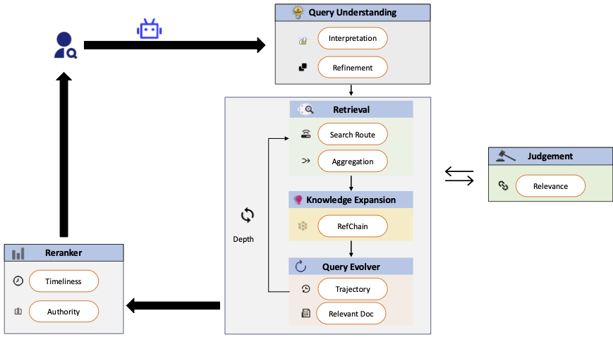

# BGTv1 — LLM-Agent Academic Paper Retrieval Framework

BGTv1 is a **tree-based academic paper retrieval system** driven by a team of LLM
agents. Given a natural-language research query it expands the query, searches
multiple scholarly sources (arXiv, OpenAlex, PubMed, Semantic Scholar, and Google
Scholar via Serper), LLM-scores every candidate for relevance, optionally follows
citation references, and returns ranked papers.



---

## 🚀 Quick Start

### 1. Install dependencies

```bash
pip install -r requirements.txt
```

> `torch` / `faiss-cpu` wheels are platform/CUDA-specific — on a non-Linux or GPU
> machine install those per their official instructions; the rest are portable.
> The reranker block (`torch`, `transformers`, `peft`, …) is **only** needed for
> `--rerank` / `--bge-prefilter`; the default LLM path runs without it.

### 2. Configure API keys

Copy the template and fill in your own keys — **never edit keys into source files**:

```bash
cp .env.example .env
# then edit .env
```

`global_config.py` auto-loads `.env` via `python-dotenv`. Minimum to run:

| Variable | Why |
|----------|-----|
| `DEEPSEEK_API_KEY` | LLM scoring + query expansion run on **every** document (required). |
| `GOOGLE_SERPER_KEY` | Drives the arXiv search route (Serper resolves arXiv IDs). |

Everything else is optional — see the comments in [`.env.example`](.env.example).
To use a different LLM backend, set `SPAR_MODEL` (e.g. `Qwen3-32B`) and the matching
key; model definitions live in `MODEL_CONFIGS` in [`local_request_v2.py`](local_request_v2.py).

> **Proxy:** under WSL2 the Windows-host gateway is auto-detected on `:7890`.
> If you don't use a proxy, set `HTTP_PROXY=`/`HTTPS_PROXY=` to empty in `.env`.

### 3. Run

**Web UI** (serves `index.html` on http://localhost:8000):

```bash
python3 demo_app_with_front.py
```


**Batch benchmark run:**

```bash
python3 run_spr_agent.py AutoScholarQuery
```

Per-query JSON + Graphviz trees are written to `./gen_result/<auto-named-folder>/`.
The folder name encodes the active config, runs are **resumable** (already-finished
queries are skipped), and `evaluate.py <run_dir>` reports P/R/F1 against gold.

#### Common CLI flags (`run_spr_agent.py`)

| Flag | Effect |
|------|--------|
| `benchmark_name` | benchmark name (positional) |
| `--model` | any key in `MODEL_CONFIGS` (default `DeepSeek-V4`) |
| `--qids` | comma-separated query ids to run |
| `--reference` | enable Phase 2 citation-reference expansion |
| `--phase3` | enable Phase 3 deeper BFS (depth > 1) |
| `--ref-api` | `openalex` (default) \| `s2` \| `local` reference source |
| `--rerank` | cross-encoder rerank of the result pool (needs `peft`) |
| `--bge-prefilter` | coarse-filter → LLM fine-rank cascade |
| `--score-prompt` | `intent` (default) \| `rubric` scoring prompt |

---

## 🧩 Architecture

The pipeline is organised as **specialist agents under [`agents/`](agents/)**.
`OrchestratorAgent.search(query, end_date)` runs a BFS tree in phases:

1. **Phase 0 — query understanding / expansion** (`QueryAgent`): intent + domain
   analysis → compact domain tree → ~5 vocabulary-injected sub-queries.
2. **Phase 1 — retrieval + scoring** (`RetrievalAgent` + `ScoringAgent`): each query
   searched across sources in parallel, deduped, then LLM-scored for relevance.
3. **Phase 2 — reference expansion** (`ReferenceAgent`, `--reference`): fetch and
   LLM-score the references of the top docs (pruned to cap cost).
4. **Phase 3 — context query generation** (`--phase3`): top docs → next-level queries.

| File / dir | Role |
|------------|------|
| [`agents/orchestrator_agent.py`](agents/orchestrator_agent.py) | BFS tree, the 4 phases, collect, timing, Graphviz |
| [`agents/query_agent.py`](agents/query_agent.py) | intent analysis, domain tree, query expansion |
| [`agents/retrieval_agent.py`](agents/retrieval_agent.py) | parallel multi-source retrieval + dedup |
| [`agents/scoring_agent.py`](agents/scoring_agent.py) | LLM relevance scoring |
| [`agents/reference_agent.py`](agents/reference_agent.py) | per-paper reference lists (OpenAlex / S2 / PubMed) |
| [`local_request_v2.py`](local_request_v2.py) | `get_from_llm()`, `MODEL_CONFIGS`, retries/caching |
| [`api_web.py`](api_web.py) | source clients (arXiv, OpenAlex, PubMed, S2, Serper) |
| [`local_db_v2.py`](local_db_v2.py) | SQLite arXiv metadata cache (`recovered.db`) |
| [`demo_app_with_front.py`](demo_app_with_front.py) | FastAPI web UI |
| [`run_spr_agent.py`](run_spr_agent.py) | batch benchmark runner |
| [`evaluate.py`](evaluate.py) | P/R/F1 + ranked-cutoff metrics vs gold |

---

## 🔧 Optional setup

### Offline arXiv cache

`./database/recovered.db` is a SQLite metadata cache; most arXiv lookups hit it
instead of `export.arxiv.org`. Populate it from the Kaggle arXiv snapshot with
`ingest_arxiv_snapshot.py`. (The `database/` directory is git-ignored.)

### Graphviz (for tree diagrams)

```bash
# Ubuntu/Debian
sudo apt-get install graphviz
# macOS
brew install graphviz
# Windows: https://graphviz.org/download/ then `pip install graphviz`
```

### Cross-encoder rerank (optional)

`--rerank` / `--bge-prefilter` use a fine-tuned `bge-reranker-v2-m3` cross-encoder
(the `./bge/` LoRA project). Requires `peft` + `sentencepiece` and the model weights
at `BGE_BASE_MODEL_PATH` / `BGE_LORA_PATH`. It **degrades gracefully** — missing
deps/model simply fall back to the default ranking.

---

## ⚠️ Notes & gotchas

- **arXiv must stay single-connection** (ToS: ≤1 req/3s). Do not re-parallelize the
  arXiv client or lower its `delay_seconds` — it triggers HTTP 429.
- **API quota:** every document is LLM-scored, so a run can consume significant LLM
  budget. Test on a small `--qids` set first.
- **`requirements.txt`** pins versions from the original conda env; `torch`/`faiss`
  may need a platform-specific install.

---

## 📄 License

Released under the [MIT License](LICENSE).

## 🤝 Contributing

Issues and Pull Requests are welcome!
